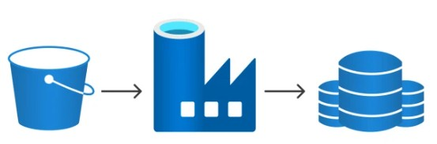
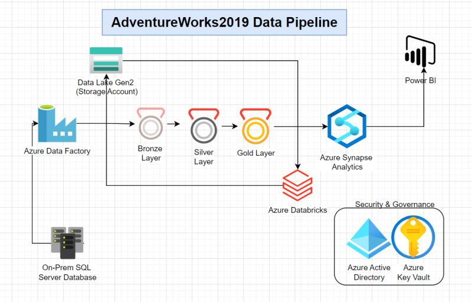

# az-data-lab

<!-- PROJECT LOGO -->
<br />
<div align="center">
  <a href="">
    
  </a>
</div>

## Goal & purpose
Ziel dieses Projekts ist es, eine **end-to-end Data Engineering-Umgebung auf Azure** aufzubauen –  Datenuploads in eine SQL-Datenbank in einem Data, Aufbau von Pipelines für die Transformation der Daten, Integration mit Databricks für die Steuerung von Data Lineage und Anwendung der Governance. Es wurde bewusst darauf geachtet, möglichst **kostengünstig** innerhalb eines Azure Free Trials zu arbeiten.

## Azure account erstellen
- Azure Free Trial mit 200 USD Budget: https://azure.microsoft.com/free/
- Account kann mit einer privaten E-Mail-Adresse erstellt werden (z. B. Gmail)
- Kreditkarte wird zur Verifizierung benötigt, es entstehen jedoch keine Kosten, solange die kostenlosen Limits nicht überschritten werden. Belastung von 1 USD zur Verifizierung.

### Overview
Für die Erstellung der Grundstruktur der Azure-Diensten wird folgendes Schema angewendet:

- **Management Group** (*optional*): Gruppieren mehrerer Subscriptions in einer Organisation. Wird hier nicht angewendet.
- **Subscription** (*Free Trial*): Repräsentiert ein Abrechnungs- und Ressourcenkonto, um innerhalb  Ressourcen und deren Limits zu definieren
- **Resource Group** (*z.B. rg-dataproject1*): Logische Sammlung von Ressourcen, wie SQL Datenbank, Storage Account, Databricks Workspace, Data Factory usw.
- **Ressourcen**: Einzelkomponenten zur Verwendung im Projekt
  - Azure SQL Database → für strukturierte Daten
  - Storage Account (ADLS Gen2) → für Dateien, Delta Lake
  - Azure Databricks → für Analyse, Transformation, ML
  - Key Vault → optional für sichere Passwörter & Secrets

Dies ermöglicht eine saubere Trennung und Verwaltung der Cloud-Infrastruktur.

## Vorbereitungen für zwei Use Cases:
### Szenario 1: Cloud based

<details>
<summary>Klicke hier, um den Ablauf anzuzeigen</summary>

<br>

- Service: Azure SQL Database
- Tier: Free/Basic (vCore serverless) für Testzwecke
- WICHTIG: Bei der Authentifizierung "SQL authentication" auswählen (nicht Entra ID oder AAD)
- Benutzername/Passwort wird direkt beim Erstellen gesetzt
- Zugriff über Firewall-Regel für eigene IP und Databricks-IP gewährleisten

### Tools

- **ODBC Driver 18 for SQL Server**  
  Download: https://learn.microsoft.com/en-us/sql/connect/odbc/download-odbc-driver-for-sql-server

- **Python 3.11+**
- **Git** für Versionierung
- **Azure CLI** für Skripting: https://learn.microsoft.com/en-us/cli/azure/install-azure-cli

### Python Libraries

```bash
pip install pyodbc pandas sqlalchemy python-dotenv
```

- `sqlalchemy` → für Verbindung zur DB
- `pandas` → für Datenverarbeitung
- `pyodbc` → für direkte SQL-Verbindung
- `dotenv` → für Umgebungsvariablen

---

### Setup Workflow

Ziel: End-to-End-Datenfluss in Azure mit Python aufbauen:

1. **Datenbank erstellen**
2. **Verbindung testen** (`db_connect.py`)
3. **Tabelle erstellen** (`db_create_table.py`)
4. **CSV-Daten laden** (`db_upload_data.py`)
5. **Verifizierung über Azure Portal oder Python**

#### Access

- Das Skript `db_connect.py` testet die Verbindung zur SQL-Datenbank mit Umgebungsvariablen aus `.env`
- Nutzt `pyodbc` für direkten SQL-Zugriff

```python
conn = pyodbc.connect(
    f"DRIVER={{ODBC Driver 18 for SQL Server}};SERVER={server};DATABASE={database};UID={username};PWD={password}"
)
```

#### Create Table

- `db_create_table.py` enthält das `CREATE TABLE`-Statement für die Tabelle `charging_stats`
- Nutzt `pyodbc` um die Tabelle direkt in der Datenbank anzulegen

#### Load Data

- `db_upload_data.py` lädt eine CSV-Datei (`charging_data.csv`) in die zuvor erstellte Tabelle
- Nutzt `pandas` + `sqlalchemy` um bulk insert durchzuführen

```python
df = pd.read_csv("charging_data.csv")
df.to_sql("charging_stats", con=engine, if_exists="append", index=False)
```

#### Verify Deployment

- Im Azure Portal: öffne die SQL-Datenbank → **Query Editor (Preview)**
- Melde dich mit SQL-Login an
- Führe z. B. aus:

```sql
SELECT TOP 10 * FROM charging_stats;
```

- Alternativ: Kontrolle auch möglich via Python/Notebook (`pd.read_sql(...)`)

</details>

---


### Szenario 2: On Prem basiert

<details>
<summary>Klicke hier, um den Ablauf anzuzeigen</summary>

<br>



1. **Einrichten der Self-hosted Integration Runtime (SHIR):**
   - Installation und Konfiguration der SHIR auf dem lokalen Server, um eine sichere Verbindung zwischen der lokalen Umgebung und Azure Data Factory herzustellen.

2. **Erstellen eines Linked Services für die lokale SQL Server-Datenbank:**
   - Konfiguration der Verbindungsdetails zur lokalen SQL Server-Datenbank in Azure Data Factory, einschließlich Servername, Datenbankname und Authentifizierungsinformationen.

3. **Erstellen eines Linked Services für Azure Data Lake Storage Gen2:**
   - Einrichtung der Verbindung zu Azure Data Lake Storage Gen2 durch Angabe des Speicherortnamens und der Authentifizierungsdetails.

4. **Erstellen einer Pipeline in Azure Data Factory:**
   - Zusammenstellung einer Pipeline mit einer Copy Data-Aktivität, die die Daten von der lokalen SQL Server-Datenbank in den Azure Data Lake Storage Gen2 überträgt.

5. **Konfigurieren der Copy Data-Aktivität:**
   - Festlegen der Quelle (lokale SQL Server-Datenbank) und des Ziels (Azure Data Lake Storage Gen2), Auswahl der zu kopierenden Tabellen oder Daten und Festlegung des Datenformats für die Speicherung im Data Lake.

6. **Veröffentlichen und Ausführen der Pipeline:**
   - Speichern und Veröffentlichen der erstellten Pipeline und anschließendes Starten der Pipeline, um den Datenübertragungsprozess zu initiieren.

7. **Überwachen der Pipeline-Ausführung:**
   - Verfolgung des Fortschritts und Überprüfung auf Fehler oder Warnungen während der Ausführung der Pipeline über die Monitoring-Funktion in Azure Data Factory.

</details>

---

### Szenario 3: Databricks & Unity Catalog Setup mit Azure SQL & Storage 🚀

<details>
<summary>Klicke hier, um den Ablauf anzuzeigen</summary>

<br>

Dieses Kapitel beschreibt Schritt für Schritt, wie eine Azure SQL-Datenbank mit Databricks (Premium Tier) verknüpft wird, um Daten zu lesen und Unity Catalog zu testen. Ideal für erste praktische Erfahrungen in einer Cloud-Datenumgebung.

---

## Voraussetzungen

- Azure Subscription mit Budget (kein Free Trial)
- Zugriff auf das Azure-Portal mit Adminrechten
- Azure SQL-Datenbank & SQL Server
- Azure Storage Account mit **Hierarchical Namespace (HNS)** aktiviert
- Databricks Free Trial mit **Premium Tier** gewählt
- Du bist der Azure **Entra Admin** / Directory Admin

---

## Ressourcen im Projekt

- **SQL Server:** `xxx-cmdb`
- **SQL Datenbank:** `xxx-cmdb/cmdb`
- **Storage Account:** `xxxxdatalake`
- **Virtual Network:** `nw-xxxxxx-xxxx`

---

## Schritt-für-Schritt Anleitung

### 1. Storage Account prüfen (Unity Catalog Voraussetzung)

> Unity Catalog benötigt einen Data Lake Storage mit aktiviertem **Hierarchical Namespace** (ADLS Gen2).

- Gehe in Azure zum Storage `xxxxdatalake`
- Navigiere zu **Configuration**
- **Hierarchical namespace = Enabled**
    - Falls **nicht aktiviert**: neuen Storage Account erstellen (mit HNS!)

---

### 2. Databricks Workspace erstellen (Premium Tier)

- Gehe im Azure-Portal zu "Azure Databricks"
- Wähle:
  - **Pricing Tier:** Premium
  - **Region:** identisch mit SQL & Storage (z. B. Switzerland North)
  - **Resource Group:** gleich wie für andere Ressourcen
- Deployment starten

---

### 3. Unity Catalog einrichten

- Navigiere im Databricks-Workspace zu **Admin Settings > Unity Catalog**
- Klicke **Enable Unity Catalog**
- Folge dem Wizard:
  - Erstelle einen **Metastore**
  - Verknüpfe den Storage Account `xxxxdatalake`
  - Lege dich als **Metastore-Admin** fest

---

### 4. Verbindung zur SQL-Datenbank herstellen (JDBC)

- Firewall-Regel im SQL Server: IP von Databricks zulassen
- Stelle sicher, dass **SQL Authentication** aktiviert ist
- Beispiel-Notebook:

```python
jdbc_url = "jdbc:sqlserver://xxx-xxxx.database.windows.net:xxxx;database=cmdb"
properties = {
  "user": "dein_user",
  "password": "dein_passwort",
  "driver": "com.microsoft.sqlserver.jdbc.SQLServerDriver"
}

df = spark.read.jdbc(url=jdbc_url, table="dbo.deine_tabelle", properties=properties)
df.display()
```

---

### 5. Daten in Unity Catalog schreiben (Delta Table)

```python
df.write.format("delta").saveAsTable("mein_catalog.mein_schema.cmdb_daten")
```

Damit sind die Daten in einer verwalteten Tabelle verfügbar und per SQL, ML oder BI nutzbar.

---

## Wichtige Hinweise

| Thema                    | Empfehlung                                   |
|-------------------------|-----------------------------------------------|
| Identität               | Unity Catalog setzt Azure Entra ID voraus     |
| Kostenkontrolle         | Single-Node Cluster & Auto-Termination aktiv |
| Rechte & Sicherheit     | Verwende Gruppen für Metastore-Zugriffe       |
| Datenquellen            | Für JDBC-Zugriffe: IP whitelisten & Auth sichern |
| Housekeeping            | Clusternutzung überwachen & ungenutzte Ressourcen löschen |

---

## Fazit

Mit diesem Setup kannst du:

- SQL-Daten in Databricks verarbeiten
- Unity Catalog aktiv testen (Metastore + Data Governance)
- Erste Pipelines oder ML-Anwendungen bauen

</details>

---


